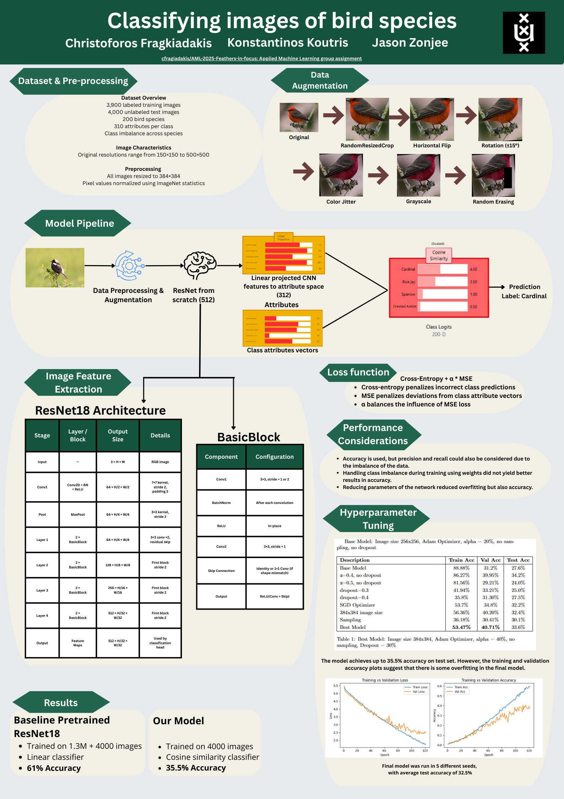

# Classification of bird species using CNN
Applied Machine Learning group assignment 2025-2026

Description of the project can be found [here](./Group_project_description.pdf).



To run the project, install [torch](https://pytorch.org/get-started/locally/) depending on on your system configuration and also run:

```bash
pip install -r requirements.txt
